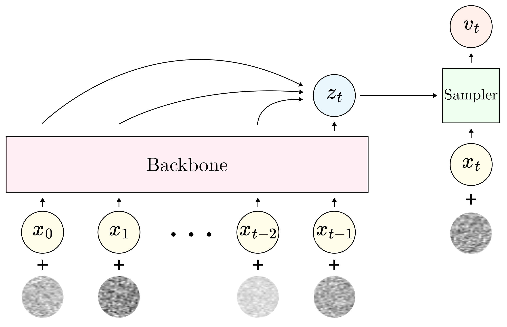

# Continuous Autoregressive Models with Noise Augmentation Avoid Error Accumulation

**Abstract**  
Autoregressive models are typically applied to sequences of discrete tokens, but recent research indicates that generating sequences of continuous embeddings in an autoregressive manner is also feasible. However, such Continuous Autoregressive Models (CAMs) can suffer from a decline in generation quality over extended sequences due to error accumulation during inference. We introduce a novel method to address this issue by injecting random noise into the input embeddings during training. This procedure makes the model robust against varying error levels at inference. We further reduce error accumulation through an inference procedure that introduces low-level noise. Experiments on musical audio generation show that CAM substantially outperforms existing autoregressive and non-autoregressive approaches while preserving audio quality over extended sequences. This work paves the way for generating continuous embeddings in a purely autoregressive setting, opening new possibilities for real-time and interactive generative applications.

## Training Process of CAM
The causal Backbone receives as input a sequence of continuous embeddings with noise augmentation. It outputs z_t, which is used by the Sampler as conditioning to denoise a noise-corrupted version of x_t.

## Audio Examples

We train all models on the task of unconditional generation of single instrument samples.

__Baselines__:

*GIVT*: [GIVT: Generative Infinite-Vocabulary Transformers](https://arxiv.org/abs/2312.02116), trained with 32 modes
*GIVT+Noise*: GIVT with 32 modes trained our proposed noise augmentation technique during training.
*MAR*: [Autoregressive Image Generation without Vector Quantization](https://arxiv.org/abs/2406.11838) using the configuration with raster order and causal direction.
*MAR RF*: MAR model trained using the [Rectified Flow](https://arxiv.org/abs/2209.03003) framework instead of the noise prediction with linear noise schedule framework.
*RF*: Non-autoregressive diffusion model trained using the [Rectified Flow](https://arxiv.org/abs/2209.03003).
*CAM*: Ours.

We show random unconditional samples generated by all models. For all autoregressive models, we generate samples with double the length of the total context of the model.

<table style="margin-left: -5cm !important; width: 150%; border-collapse: collapse; border: 2px solid black; text-align: center;">
  <!-- Sample 1 -->
  <tr>
    <th style="width: 16.66%;">GIVT</th> 
    <th style="width: 16.66%;">GIVT+Noise</th>
    <th style="width: 16.66%;">MAR</th>
    <th style="width: 16.66%;">MAR RF</th>
    <th style="width: 16.66%;">CAM</th>
  </tr>
  <tr>
    <td>
      <audio src="givt/1.mp3" controls></audio>
    </td>
    <td>
      <audio src="givt_noise/1.mp3" controls></audio>
    </td>
    <td>
      <audio src="mar/1.mp3" controls></audio>
    </td>
    <td>
      <audio src="mar_rf/1.mp3" controls></audio>
    </td>
    <td>
      <audio src="rf/1.mp3" controls></audio>
    </td>
    <td>
      <audio src="cam/1.mp3" controls></audio>
    </td>
  </tr>

</table>
